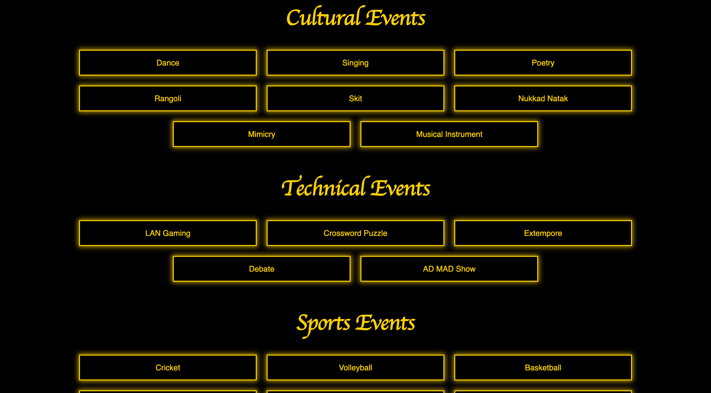
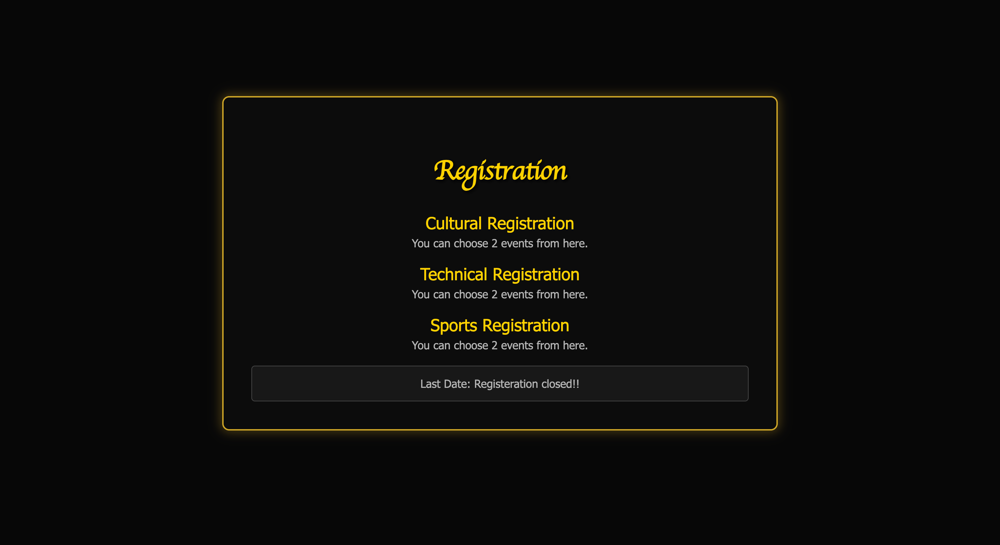

<h1 align="center">🚀 Euphoric 2025</h1>

<p align="center">
  
  
  
  
</p>

**Euphoric 2025** is a campus-centric web platform designed to manage **event registrations**, share **important announcements**, and **showcase student-led activities**. Created for Euphoric Fest, it offers a central space for students to stay updated and involved.

🌐 **Live Site:** [https://euphoric-2025.42web.io](https://euphoric-2025.42web.io)


---


## 🖼️ Preview

A quick look at the Euphoric 2025 interface:

| Landing Page | Event Cards    | Registeration  |
|------------|--------------------------|--------------------------|
|  |  |  |


> 📸 These screenshots will be updated with any changes to the website's UI, code, or features to reflect the latest version of the web platform.

---


## 🚀 Features

- 📅 **Event Listings**  
  Explore upcoming events with dates, descriptions, and highlights.

- 📝 **Registration Forms**  
  Seamless registration experience with dedicated sign-up sections.

- 📢 **Announcements**  
  Key updates and latest news displayed prominently on the home page.

- 🎨 **Responsive UI**  
  Mobile-friendly layout using pure HTML and CSS.

- 💻 **Lightweight & Fast**  
  No frameworks – just clean, structured code for optimal speed.


---


## 🧩 Project Structure

```plaintext
Euphoric-2025/
├── assets/                        # Images and static files
│   └── css
│   └── js
│   └── lib
├── config/                        # Configuration files
│   └── api.php
│   └── database.php
│   └── db_operations.php
│   └── sportsapi.php
│   └── techapi.php
├── img/                            # Image files
├── includes/                       # Shared HTML files
│   └── coordinators.html
│   └── register-links.php
│   └── rules.html
│   └── schedule.html
├── README.md                       # Project documentation
├── cultural-form.php               # Cultural event form
├── footer.html                     # Footer section
├── gallery-styles.css              # Styling for the gallery
├── gallery.html                    # Gallery page
├── index.php                       # Landing/home page
├── navbar.html                     # Navigation bar
├── sports-form.php                 # Sports event form
└── technical-form.php              # Technical event form
```


---


## 🧰 Tech Stack

| Technology | Purpose                 |
|------------|--------------------------|
| HTML       | Markup / Structure       |
| CSS        | Styling / Layout         |
| JavaScript | Frontend interactivity (likely in the js/ folder) |
| PHP | Server-side scripting (for dynamic content and forms) |

---


## 🛠️ Installation Guide

Follow the steps below to set up the **Euphoric-2025** website locally on your machine. You can choose between running the project directly or using a development server for a more interactive experience.

1. 📥 **Clone the Repository**
   
    - First, you’ll need to clone the project repository from GitHub to your local machine. Open your terminal and run the following command:

      ```bash
       git clone https://github.com/AshiTomar210/Euphoric-2025.git
       ```
       This will create a copy of the repository in your current directory. Once it’s done, navigate into the project folder:

        ```bash
         cd Euphoric-2025
        ```

2. 🖥️ **Running Locally**
   
    There are two easy ways to view the project locally on your machine:

    - **Option A: Open Directly in Browser**
   
       This is the simplest way to view the project:

       1. Navigate to the `Euphoric-2025` folder where you cloned the repository.

       2. Locate the `index.html` file.

       3. Double-click on `index.html` to open it directly in your browser.

       Note: This method works well for viewing the project, but it does not support dynamic features like live reloading. For a better development experience, see Option B.

    - **Option B: Run with Live Server (Recommended for Development)**
   
      For a more interactive experience (including features like live reloading when changes are made to the project files), use the Live Server extension in Visual Studio Code (VS Code).

      1. If you haven’t already, download and install Visual Studio Code.

      2. Open your project folder in VS Code:
         ```bash
         code .
         ```
      3. Install the Live Server extension from the VS Code marketplace:

         1. Go to the Extensions view in VS Code (click the Extensions icon in the Activity Bar on the side of the window).

         2. Search for **Live Server** and click `Install`.

      4. Once installed, right-click on the index.html file in the Explorer pane and choose **Open with Live Server**.

          Your project will automatically open in your default browser, and any changes you make to the code will be reflected instantly without needing to manually refresh the page.

3. **Troubleshooting**
   
    If you encounter any issues during installation, here are a few common fixes:

    - Live Server not working?
      
        Ensure that you have the Live Server extension installed and activated in VS Code. You may need to restart VS Code after installation.

    - Browser not opening?
      
        If you're using Option A and double-clicking the index.html doesn’t work, try right-clicking the file and selecting Open with → your preferred browser.

    - Git clone not working?
      
        If you get an error when cloning the repo, ensure that you have Git installed on your machine. You can install Git from here.


---


## 🤝 Contribution Guidelines

We welcome contributors of all experience levels!
Want to help improve this website? Follow the steps below to get started:

🧾 **Steps to Contribute**:

   1. Fork the repository


   2. Clone it to your local system
      ```bash
      git clone https://github.com/your-username/Euphoric-2025.git
      cd Euphoric-2025
      ```

   3. Create a branch for your changes
      ```bash
       git checkout -b feature/your-feature-name
      ```

   4. Make your changes (UI improvements, bug fixes, new pages, etc.)


   5. Commit your work
      ```bash
      git commit -m "Add: brief description of your update"
      ```

   6. Push to your GitHub fork
      ```bash
       git push origin feature/your-feature-name
      ```

   7. Open a Pull Request with a clear description


🙋 **What Can You Contribute?**


- 🎨 UI/UX Improvements

- 🐛 Bug Fixes or Broken Layouts

- 📄 Page Additions (About, Events, FAQ)

- 🌐 Mobile Responsiveness

- 📢 Accessibility & Readability Improvements


> 💬 Feel free to open an issue if you’d like to discuss your idea before working on it!


---


## 🚀 GirlScript Summer of Code (GSSoC) 2025

This project is part of **GSSoC '25**, a nationwide initiative encouraging students to contribute to real-world open source projects.

🛠️ New contributors are welcome — whether it's design, content, code, or ideas!

> 📌 To participate, fork the repo, make your changes, and submit a Pull Request.


---


## 🙋 Maintainer

Built with 💜 by @AshiTomar210

> Connect via GitHub for queries, ideas, or collaborations!


---
